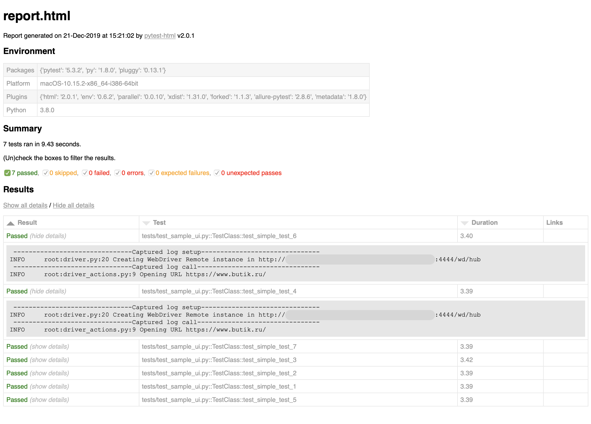

# Acceptance Tests framework sample. Powered by Python and Selenium.
=================================================
## Requirements
Python 3.9+

## Install for MacOS
### Install Python 3
https://www.python.org/downloads/

### Install pip if needed
https://pip.pypa.io/en/stable/installing/#installing-with-get-pip-py

### Install pipenv
https://pypi.org/project/pipenv/

With brew: `brew install pipenv`

### Set your Selenoid server
Look for config `pytest.ini` or another config and set your Selenoid server host to GGR_PLAYBACK_HOST
For example by: https://github.com/sakharovmaksim/my-local-selenoid

## Для pre-commit проверок установи pre-commit
1. Для Linux `pip install pre-commit` или для Mac `brew install pre-commit`

2. Ты должен выполнить `pipenv install` до или сделай это прямо сейчас;

3. Установи git-хуки в свою .git-папку:
`pre-commit install`
Удали `rm .git/hooks/pre-commit.legacy` если этот хук был создан предыдущей командой

4. Запустить принудительную проверку всех файлов в проекте:
`pre-commit run --all-files`

5. Запустить проверку только для измененных файлов (нужен git add --all):
`pre-commit run`

### Run your tests with Docker in easy way
`bash run-tests-in-docker.sh --tests-dir=tests --config=pytest-dev.ini`
or simply
`bash run-tests-in-docker.sh --config=pytest-dev.ini` with default dir with tests

### Run your tests with local Python
`pipenv run pytest tests -c tests/pytest-dev.ini` – with config `pytest-dev.ini`

### Run your tests with parallel mode
Change in *.ini-file `addopts = -nX` option for desired count of parallel tests

## Docker
Create docker image from Dockerfile https://github.com/sakharovmaksim/acceptance-tests-base-docker-image-python or pull from https://hub.docker.com/repository/docker/sakharovmaksim/acceptance-tests-base-image-python

## HTML report output
Add "--html=\`pwd\`/output/report.html --self-contained-html" to pytest-command to generate HTML-report in .../output/ directory
Default for docker-script

## Run with custom ONE thread and without reruns on failed tests. Hint: Use for development tests
`pipenv run pytest tests -c tests/pytest.ini -n0 --reruns 0`

## Run one specific test
`pipenv run pytest tests/test_sample_ui.py -k 'test_simple_example_1' -c tests/pytest.ini`

## Run one specific file with tests
`pipenv run pytest tests/test_sample_ui.py -c tests/pytest.ini`

## Config count of rerunning failed tests
`-max-runs=X` in pytest.ini file

## Mobile emulation
For setting up mobile emulation use `@pytest.mark.mobile` fixture for test method or class

# Visual models tests
Create visual models references. Run in reference mode `pipenv run pytest tests -c tests/pytest-reference-dev.ini`
Test visual models candidates. Run in testing mode `pipenv run pytest tests -c tests/pytest-testing-dev.ini`

## Формирование Allure-отчета
1. Установить allure serve для локальной генерации отчета: https://docs.qameta.io/allure/#_installing_a_commandline
2. После выполнения тестов выполнить: `allure serve output/allure-results/`
3. В CI/CD изпользуй Allure Service и транспорт до него
